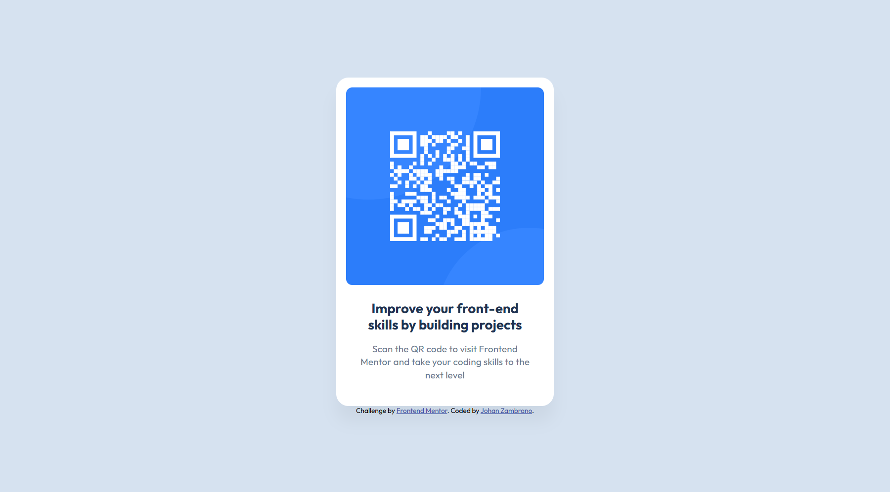
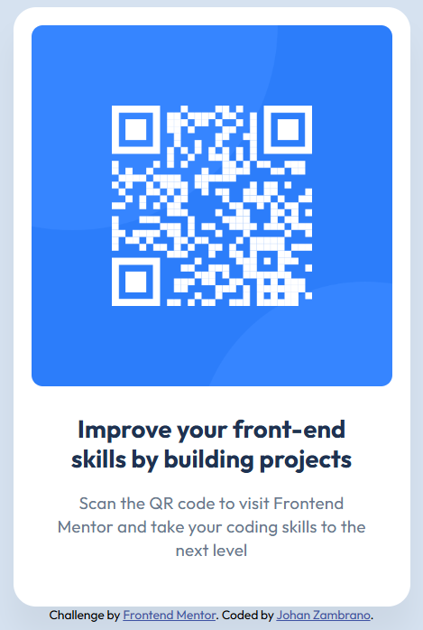

# Frontend Mentor - QR code component solution

This is a solution to the [QR code component challenge on Frontend Mentor](https://www.frontendmentor.io/challenges/qr-code-component-iux_sIO_H). Frontend Mentor challenges help you improve your coding skills by building realistic projects. 

## Table of contents

- [Overview](#overview)
  - [Screenshot](#screenshot)
  - [Links](#links)
- [My process](#my-process)
  - [Built with](#built-with)
  - [What I learned](#what-i-learned)
  - [Continued development](#continued-development)
  - [Useful resources](#useful-resources)
- [Author](#author)

## Overview

### Screenshot

#### Desktop View


#### Mobile View


### Links

- Solution URL: [GitHub Repository](https://github.com/jazs790715/QR-code-component)
- Live Site URL: [Add live site URL here](https://jazs790715.github.io/QR-code-component/)

## My process

### Built with

- Semantic HTML5 markup
- CSS custom properties
- Flexbox
- CSS logical properties (inline-size, margin-block, padding-inline)
- Custom font loading with @font-face
- Mobile-first workflow
- **Figma** - For design inspection and specifications

### What I learned

During this project, I reinforced important knowledge about modern CSS, semantic structure, and the use of professional design tools:

**1. Working with Figma for more professional development**

Using Figma as a design tool completely transformed my workflow and elevated the quality of the final result:

- **Precision in measurements**: Figma allowed me to extract exact values for spacing, font sizes, and component dimensions, eliminating guesswork and ensuring pixel-perfect implementation.

- **Precise color system**: I was able to obtain exact HSL values directly from the design:
```css
:root {
    --White: hsl(0, 0%, 100%);
    --Slate-300: hsl(212, 45%, 89%);
    --Slate-500: hsl(216, 15%, 48%);
    --Slate-900: hsl(218, 44%, 22%);
}
```

- **Consistent typography**: Figma provided detailed information about the Outfit font (weights 400 and 700), specific sizes (22px for headings, 15px for paragraphs), and exact line-heights (120% and 140%).

- **Shadow and effects inspection**: I was able to replicate the box-shadow from the design exactly:
```css
box-shadow: 0px 25px 25px rgb(0 0 0 / 4.77%);
```

- **Asset export**: Made it easy to export the QR image in optimal size and format, maintaining visual quality.

**Advantages of using Figma in development:**
- ✅ Reduces development time by having clear specs
- ✅ Minimizes iterations and visual adjustments
- ✅ Improves communication between design and development
- ✅ Guarantees fidelity to the original design
- ✅ Facilitates the creation of scalable design systems

**2. CSS Logical Properties**: I implemented properties like `inline-size`, `margin-block`, and `padding-inline` instead of traditional physical properties:

```css
.qr-card {
    inline-size: 20rem;
    padding-inline: var(--space-200);
    padding-block-start: var(--space-200);
    padding-block-end: var(--space-500);
}
```

**3. Custom font loading**: I learned to load local fonts with @font-face while optimizing performance:

```css
@font-face {
    font-family: 'Outfit';
    src: url('./assets/fonts/static/Outfit-Bold.ttf') format('truetype');
    font-weight: 700;
    font-display: swap;
}
```

**4. Flexbox centering**: I implemented perfect vertical and horizontal centering using flexbox on the body:

```css
body {
    display: flex;
    flex-direction: column;
    align-items: center;
    justify-content: center;
    min-height: 100vh;
}
```

**5. Organized CSS variables**: I created a design token system based on Figma specifications:

```css
:root {
    /* Color tokens from Figma */
    --White: hsl(0, 0%, 100%);
    --Slate-300: hsl(212, 45%, 89%);
    
    /* Spacing tokens from Figma */
    --space-500: 2.5rem;
    --space-300: 1.5rem;
    --space-200: 1rem;
}
```

### Challenges faced and solutions

**Challenge 1: Transitioning from design to code**
- **Problem**: Correctly interpreting the visual design and translating it into precise CSS.
- **Solution**: Used Figma to inspect the design, obtain exact measurements, and create CSS variables that reflect the design system. This eliminated guesswork and accelerated development.

**Challenge 2: Perfect vertical and horizontal centering**
- **Problem**: Making the QR component centered exactly as in the Figma design.
- **Solution**: Used `min-height: 100vh` on the body with flexbox to guarantee perfect centering regardless of screen size.

**Challenge 3: Correct semantic structure**
- **Problem**: Deciding on the appropriate semantic HTML structure while maintaining visual fidelity.
- **Solution**: I used `<main>` for the main content and `<article>` for the card component, improving accessibility without compromising the design.

**Challenge 4: Exact spacing and proportions**
- **Problem**: Maintaining the exact proportions from the Figma design.
- **Solution**: Implemented a CSS variable system based on Figma's spacing tokens (16px, 24px, 40px) to maintain absolute consistency with the design.

**Challenge 5: Font optimization**
- **Problem**: Loading the Outfit font specified in Figma without affecting performance.
- **Solution**: Implemented @font-face with `font-display: swap` and local font loading to optimize initial performance.

### Continued development

Areas I need to continue developing:

1. **Advanced Figma**: 
   - Learn to use Figma components and variants
   - Master Auto Layout to better understand flexible design systems
   - Explore Figma plugins to accelerate workflow (such as CSS export plugins)

2. **Design Systems**: 
   - Create more robust design token systems based on Figma
   - Implement tools like Style Dictionary to sync tokens between Figma and CSS

3. **CSS Logical Properties**: Deepen their use for complex layouts and edge cases with RTL.

4. **Font optimization**: Learn more about font loading strategies (subsetting, WOFF2, variable fonts).

5. **Advanced responsive design**: Implement techniques like container queries and fluid values with `clamp()`.

6. **Accessibility**: Improve the use of ARIA attributes and ensure better color contrast according to WCAG 2.1.

7. **Collaboration workflow**: Improve communication with designers using tools like Figma comments and Dev Mode.

### Useful resources

- [Figma for Developers](https://www.figma.com/developers) - Official documentation that helped me understand how to inspect designs and extract CSS.
- [Figma Dev Mode](https://help.figma.com/hc/en-us/articles/15023124644247-Guide-to-Dev-Mode) - Essential guide for developers working with Figma designs.
- [MDN CSS Logical Properties](https://developer.mozilla.org/en-US/docs/Web/CSS/CSS_Logical_Properties) - Helped me understand logical properties and their implementation.
- [CSS Tricks - Complete Guide to Flexbox](https://css-tricks.com/snippets/css/a-guide-to-flexbox/) - Excellent reference for centering and alignment with flexbox.
- [Web.dev - Font Best Practices](https://web.dev/font-best-practices/) - Useful guide for custom font optimization.
- [Design Tokens](https://www.designtokens.org/) - Standard for creating scalable token systems between design and development.

## Author

- Website - [Johan Zambrano](https://github.com/jazs790715)
- Frontend Mentor - [@jazs790715](https://www.frontendmentor.io/profile/jazs790715)
- GitHub - [@jazs790715](https://github.com/jazs790715)
